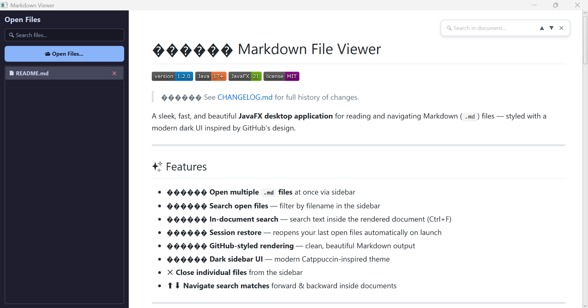

# 📄 Markdown File Viewer


> 📋 See [CHANGELOG.md](CHANGELOG.md) for full history of changes.

A sleek, fast, and beautiful **JavaFX desktop application** for reading and navigating Markdown (`.md`) files — styled with a modern dark UI inspired by GitHub's design.


---

## ✨ Features

- 📂 **Open multiple `.md` files** at once via sidebar
- 🔍 **Search open files** — filter by filename in the sidebar
- 🔎 **In-document search** — search text inside the rendered document (Ctrl+F)
- 💾 **Session restore** — reopens your last open files automatically on launch
- 🎨 **GitHub-styled rendering** — clean, beautiful Markdown output
- 🌙 **Dark sidebar UI** — modern Catppuccin-inspired theme
- ✕ **Close individual files** from the sidebar
- ⬆⬇ **Navigate search matches** forward & backward inside documents

---

## 🖥️ Screenshots

> *(Add screenshots here after first run)*

---

## 🛠️ Tech Stack

| Technology | Purpose |
|---|---|
| Java 17+ | Core language |
| JavaFX 21 | UI framework |
| CommonMark | Markdown parsing |
| NetBeans | IDE / Build tool |

---

## 🚀 Getting Started

### Prerequisites

- Java JDK 17 or later
- JavaFX SDK 21+ ([download here](https://openjfx.io/))
- NetBeans IDE (recommended) or any Java IDE

### Run the Project

1. **Clone the repo:**
   ```bash
   git clone https://github.com/rushi008/Markdown-File-Viewer.git
   cd Markdown-File-Viewer
   ```

2. **Open in NetBeans:**
   - File → Open Project → Select the `MarkdownApp` folder

3. **Set up JavaFX SDK:**
   - Go to Project Properties → Libraries
   - Add your local `javafx-sdk/lib` folder

4. **Run:**
   - Press `F6` or click the Run button

---

## ⌨️ Keyboard Shortcuts

| Shortcut | Action |
|---|---|
| `Ctrl + F` | Open in-document search bar |
| `Enter` | Find next match |
| `▲ / ▼` buttons | Navigate previous / next match |
| `✕` button | Close search bar |

---

## 📁 Project Structure

```
MarkdownApp/
├── src/
│   └── markdownviewer/
│       └── MarkdownViewer.java   # Main application
├── lib/                          # CommonMark JAR dependencies
├── nbproject/                    # NetBeans project config
├── build.xml                     # Ant build file
└── README.md
```

---

## 🔄 How to Update GitHub

After making changes to your code:

```bash
# 1. Stage all changes
git add .

# 2. Commit with a message
git commit -m "describe your change here"

# 3. Push to GitHub
git push
```

---

## 📦 Dependencies

- [commonmark-java](https://github.com/commonmark/commonmark-java) — Markdown parser
- [commonmark-ext-gfm-tables](https://github.com/commonmark/commonmark-java) — GitHub Flavored Markdown tables

---

## 🤝 Contributing

Pull requests are welcome! For major changes, please open an issue first.

---

## 📄 License

This project is open source and available under the [MIT License](LICENSE).

---

## 🕓 Latest Changes

### v1.2.0 — 2026-08-13
- 🔎 In-document search bar with ▲ ▼ navigation and Ctrl+F shortcut
- ✕ Close & 🔍 reopen search icon button
- ✕ Clear button inside sidebar file search
- 🖼️ Fixed emoji rendering in WebView (Segoe UI Emoji font)

### v1.1.0 — 2026-08-13
- 🔍 Sidebar search to filter open files by name

### v1.0.0 — 2026-08-13
- 🎉 Initial release with multi-file sidebar, dark theme, session restore & GitHub-styled rendering

> 📋 Full details in [CHANGELOG.md](CHANGELOG.md)
